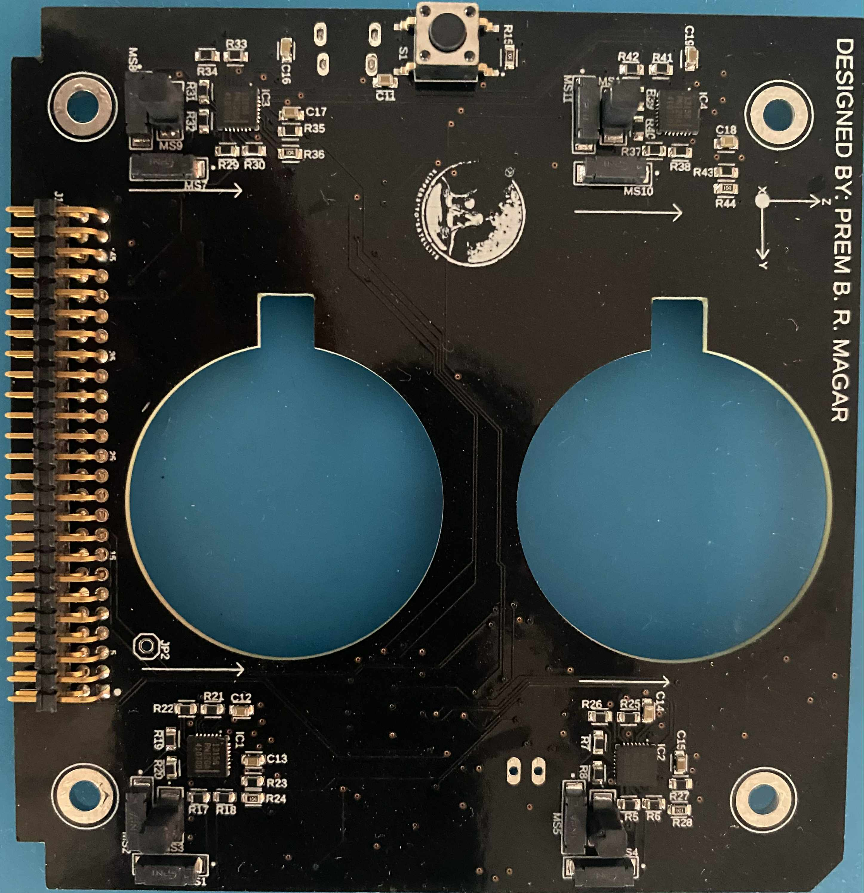

# 📝 How to Write, Edit, and Upload Technical Articles

Welcome Prem! This guide explains how to write new articles or edit existing ones on your website (**premrana.com.np**).

---

## 📁 The Only File You Need to Edit:
All technical articles and laboratory logs are stored in one clean, dedicated file:
👉 [`articles-data.js`](file:///home/prem/Desktop/hugo-website/articles-data.js)

You do **not** need to touch any HTML, CSS, or complex JavaScript files.

---

## ✍️ Step-by-Step: Adding a New Article

### Step 1: Open `articles-data.js`
Open [`articles-data.js`](file:///home/prem/Desktop/hugo-website/articles-data.js) in your editor.

### Step 2: Copy and Paste the Starter Template
Paste this template into the `window.ARTICLES_DATABASE` array:

```javascript
  {
    id: 'unique-article-slug',
    title: 'Your Article Title Goes Here',
    category: 'Embedded Systems', // Choose: Embedded Systems, Silicon VLSI, Satellite RF, Geomagnetics, Computer Vision, Cleanroom & Infrastructure, Laboratory Logs
    date: 'Sep 2026',
    readTime: '5 min read',
    excerpt: 'A 1-2 sentence executive summary of what this article covers.',
    content: `
      <h2>1. Introduction</h2>
      <p>Write your problem statement and research background here.</p>

      <h2>2. Hardware & Firmware Architecture</h2>
      <p>Describe your circuit design, register configuration, or mathematical formulations.</p>

      <pre><code>// Insert your C, Verilog, or Python code here</code></pre>

      <h2>3. Test Results & Discussion</h2>
      <p>Summarize laboratory test bench measurements or telemetry readings.</p>
    `
  },
```

---

## 🎨 Useful Formatting Shortcuts for Article Content

Inside the `content: \` ... \`` field, you can use these simple HTML tags:

### Section Headings:
```html
<h2>1. Section Title</h2>
<h3>1.1 Sub-section Title</h3>
```

### Regular Paragraphs:
```html
<p>This is standard explanatory text for your technical article.</p>
```

### Code Snippets (C, Verilog, Python, Shell):
```html
<pre><code>// Your code here
void main(void) {
    printf("Hello CubeSat\n");
}</code></pre>
```

### Bullet Points:
```html
<ul>
  <li>First technical point</li>
  <li>Second technical point</li>
</ul>
```

### Embedding Photos:
```html

<p style="font-size: 0.85rem; color: #9ca3af; text-align: center;">Figure 1: EPDM Flight Board top layer.</p>
```

### Embedding Videos:
```html
<video controls style="width: 100%; border-radius: 6px; margin: 1rem 0;">
  <source src="video/CW_GMSK.mp4" type="video/mp4">
</video>
```

---

## 🚀 How to Upload to GitHub (One-Click!)

We created a simple helper script named `upload.sh`.

Whenever you add or edit articles, simply open your terminal in this directory and run:

```bash
./upload.sh "Publish article on [Your Title]"
```

The script will automatically:
1. Stage all your new articles, photos, and videos.
2. Create a clean git commit.
3. Push live to GitHub (`git push origin main`).

---

## 🌐 Test Locally Before Uploading:

Open your browser at:
```
http://localhost:8080/#articles
```
You will immediately see your newly added article card and can click to read it!
